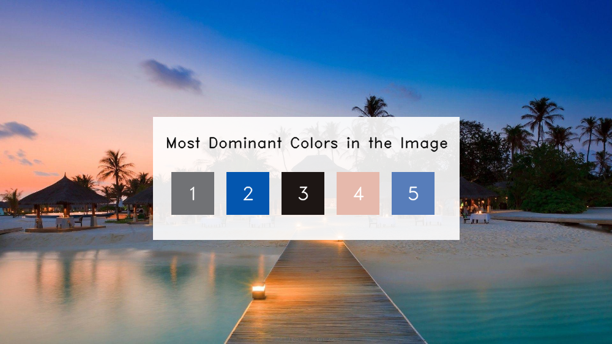

# most-dominant-color  
Dominant Colors in the Image...🌈🌈  

I have done many advanced projects using DNNs, CNNs and have seen their respective astonishing powers but this project, it is so simple, but still one of my favorite projects till date, because of the power of the #KMeans clustering algorithm.  

PS: Major music platforms use this technique on their platforms to make color contrasts.  

Do visit my blog for better explanations: https://machinelearningprojects.net/most-dominant-colors-in-an-image/

